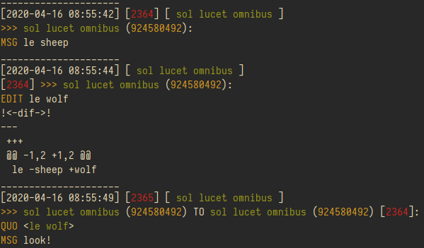

# awful-bot
Telethon based telegram selfbot. It's awful, but it works.  


## Installation
* [Read manuals](https://github.com/LonamiWebs/Telethon)  

1. Clone:
    * `git clone https://github.com/sertraline/awful-bot && cd awful-bot`  
2. Install requirements:
    * `python3 -m pip install --user -r requirements.txt`  
3. Edit `config.py` to your own (more details inside)  
4. Log in, enter your phone number and login code: `python3 bot.py`

### pip segfault while installing cffi (Ubuntu)  
`cffi` is a package required by python cryptography which is used by `cryptg` and `aiohttp` packages. Installing it may result in segfault.  

There are several workarounds for this:
1. Install requirements with sudo;
2. Set up virtualenv and launch bot from there: `python3 -m venv env; source env/bin/activate; python3 bot.py`
3. (If you have python3-cffi package installed) remove python3-cffi from apt and install as python module using pip:  
`apt remove python3-cffi && python3 -m pip install cffi`  

## Usage  
Launch in the background: `exec nohup python3 -u bot.py &`  
For Windows: `python bot.py`  

`logs` folder will be created that will contain chat logs sorted by year, month and day.

## Logging
Bot will log user `is_joined` and `is_left` events, message edits, filetype+filesize, stickers (only the name).

Edits will be shown with diff, only if the original message was logged already:

  
```
[2020-04-15 21:39:48]   |            [2344]              |         [ sol lucet omnibus ]
^^^ date of the event   | ^^^ message ID in the chat     | ^^^ name of the chat message was sent to
>>> user (user 1 id) TO user (user 2 id) [user 2 message id in the chat]
QUO [quote of user 2 message]
MSG user 1 message
```
Chat message ID is marked with red color. In edited messages it is located behind ">>>" because it points at already existing message. In each chat message IDs start from 0 and are incremented with each user message.  

Old log files (timedelta day=-2) will be packed in .zip file with corresponding filename.

## Basics

### Startup
If you don't plan to use any particular module, insert its name in IGNORED list located in `config.py`. You can look up for modules in `awful-bot/core/modules/` directory.  

If I wanted to disable evaluation module and tesseract module, my list would look like that:  
```
IGNORED = [
  'evaluate',
  'tesseract',
]
```  

### Debug
Set `DEBUG` to `True` in `config.py` to print out debug log in your terminal. This log can be found in bot directory named `debug.log`.  

### SFTP
Set `SFTP_ENABLED` to `True` in `config.py` to send saved media to remote SFTP server. Configure subsequent SFTP variables in config to your own as well.  

### Private commands

Private commands work only if they are sent by yourself to yourself, i.e to 'Saved Messages' dialog.  

Send `!private` to yourself to get a list of all available private commands.  

#### Saving media
You can track a specific user for media. You can do it manually or through simple interaction interface.  

For manual track you have to know user ID, which can be found in 4 ways:  
1. With `!ids` command to display list of all user IDs fetched by bot, from newer to older;  
2. With `!dialogs` command to display list of all your dialogs in the client;  
3. With `!info username` command to find a specific user by his username or nickname.  
4. Looking for ID in the log file.  

Knowing the ID, you can use the following:  
`!track_voice 123456789`  
`!track_images 123456789`  
`!track_messages 123456789`  

After that, all images and voices from 123456789 will be fetched in separate folders, and, if SFTP is enabled, uploaded to a remote SFTP server. All `track` commands will forward tracked message to 'Saved Messages' dialog.  

#### Interaction
Using `!ids` and `!dialogs` commands you will call a simple interaction interface which you can navigate through using commands `next` to get next page of items (if available) or `get row` to select rows in displayed table.  

The table looks like that:  
```
[1] Item 1
[2] Item 2
...
```  

To select any of two items you would type `get 1` or `get 2` in the chat it was called (if method is not private: currently all methods are private).  

Using `!ids` and `!dialogs` in the chat, the result of your selection will give you ability to get selected user info, add to blacklist, whitelist or set him on track for media.  

#### List management
Manage your whitelist, blacklist and track lists by using `!manage` command. Using it without arguments will display available lists for management:  
```
whitelist
blacklist
image_tracker
voice_tracker
msg_tracker
```  

Then you can use `!manage msg_tracker` to get a list of chats and users which messages are being tracked.  

#### Messages removal
To remove N messages from the chat you want, you can use `!remove`.  

To remove 10000 messages from `testchat`:  
`!remove 10000 testchat`  

Instead of username (`@testchat`) IDs can be used as well.  

#### Accessing log file
If bot is hosted on a remote server you can access its log file.

Send `!log` to get your current log file.
Send `!last` to get last 8 events from the log file or `!last N` to get last N events: `!last 15`

#### VK API
Provide your VK login (email or phone number) and password in `config.py` to download music from VK posts. Remove `vkdl` module from IGNORED list in `config.py`.  

Download each song from wall post individually: `!vkdl https://vk.com/wall-post`  
Download all songs from wall post and pack in .zip file: `!vkdl https://vk.com/wall-post zip`  

Download playlist: `!vkdl https://vk.com/link_to_playlist`  
Accepts zip argument.

Download songs from user audios: `!vkdl https://vk.com/audios_some_id counter`, where counter is the number of songs to download (default=10).  
Does not accept zip argument due to filesize limits.  

All credits belong to [vk_api](https://github.com/python273/vk_api) project and its contributors.  

##### Youtube-dl
If you want to use youtube-dl module and you have your own server, you can insert path to your video folder on your server and URL which will be appended to it (can be IP address as well) in the config.py.  

If no path and no url have been specified, bot will upload videos directly to telegram (may be a slow process).  

##### Tesseract (Ubuntu)
If you want to use tesseract, you should install it and its language packs first.  

Install tesseract:  
```
sudo apt install tesseract-ocr
sudo apt install libtesseract-dev
```  
Install language packs:  
```
sudo apt install tesseract-ocr-eng tesseract-ocr-rus tesseract-ocr-fra tesseract-ocr-jav tesseract-ocr-ell \
tesseract-ocr-hin tesseract-ocr-ita tesseract-ocr-chi-sim tesseract-ocr-san tesseract-ocr-pol tesseract-ocr-ukr \
tesseract-ocr-deu tesseract-ocr-ara
```

Remove 'tesseract' from IGNORED list in config.py.  

##### Eval
This bot provides `evaluate.py` module which uses `eval()` to calculate received expressions. Eval is not safe, however the command is being processed by regex before execution (`sub [^\d\.\*\+\-\/\(\)]`). Eval itself is being isolated from __builtins__: `{'__builtins__': None}` and being launched in a separate process which is terminated if it takes >3 seconds to execute.  

End user has no access to commands different from digits and math operands, so in theory there should be no possibility of retrieving builtins back.  

If you don't want to use this module anyway, add `'evaluate'` to the IGNORED list in `config.py` so it won't be loaded at the next bot launch.  

## Public commands usage

You can change the ending (@moe) and the beginning (!) of command in `config.py`.  

```
Curl -I:
  !curl@moe http://website.com/

Geoip:
  !geoip@moe 1.1.1.1

IP Lookup:
  !getip@moe http://website.com/

Eval:
  !eval 2+2

Weather:
  !weather@moe Moscow

OCR:
  Reply or send media with !ocr_eng command
Language list:
  [eng, rus, fra, jav, ell, hin, ita, chi, san, pol, ukr, deu, ara, spa]
Reply to any image with command to OCR it.

Translator:
Languages list:
  [ru, ja, en, uk, pl, de, fr, no, es, fi, hy, pt, ar, zh, cs, el, he, it, hr]
Usage:
  !tren text
  !trpl Poland can into space
Reply to any message with command to translate it.

Youtube-dl:
  !youdl@moe http://link.to/thevideo
  !youdl@moe 360 http://link.to/thevideo
  Will download video in 360p
Available quality: 360/480/720

Download audios from VK post:
  !vkdl link_to_wall_post
  In zip format: !vkdl link_to_wall_post zip

Ping:
  !ping

Image tools:
  !image grayscale

  !image rotate [degree]: !image rotate 90

  !image resize [fx] [fy] [interpolation]:
      !image resize 2.5 2.5 linear
      !image resize 2 2
      interpolation: cubic, linear, lanczos, nearest

  !image denoise [filter_strength]: !image denoise 13

  !image flip [v|h]: !image flip h
```  
